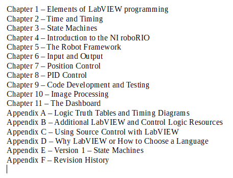
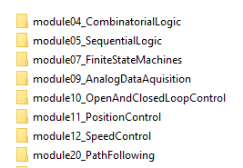

# FRC_Secret_Book_Of_FRC_LabVIEW-2 - FRC LabVIEW and Control Theory training

This material is an UNOFFICIAL set of training materials for the FRC robotics competition.  It focuses on the use of LabVIEW to program robots.  There is also a separate section containing some control theory training.  This training can be used with any programming language.

---
## The Secret Book Of FRC LabVIEW

This book strives to provide the reader with everything needed to learn LabVIEW, basic control system theory, and program an FRC robot using LabVIEW.  

I am not the original author this book.  That individual is no longer involved with a First FRC team.  This update adds additional information and revises the book for the latest FRC control system hardware.  See the book's introduction for additional information.  Here is the book's table of contents.

---
## Control Theory Training

This is a set of presentations about control theory that I've used with the team that I help mentor.  These presentations focus less on programming and more on control theory logic.  Most of the chapters contain sample logic and exercises.  The training applies to and can be used with any FRC programming language.  All the the examples and exercise templates are in LabVIEW though.  

There is also a library of LabVIEW subVI used to assit in the completion of exercises.  Teams should write their own version of these routines for use their robot.  As such the library is designed to execute only on PCs and will fail when used on a robot.

The examples make use of the the FRC LabVIEW trajectory library, https://github.com/jsimpso81/FRC_LV_TrajLib.  This library needs to be installed before using the samples.

This training is evolving.  Here a list of the current presentations.

---
## Reporting Issues

Use the github issues menu to submit information on issues and suggested enhancements.  
I'll attempt to deal with issues in a reasonable time, but there are no guarantees.

When submitting an issue, please follow these guidelines:
- Make certain you are using the latest version of the repository.  If not, install the latest version and see if the issue still occurs.
- See if the issue has already been reported.  If so, add any new details to the existing issue.
- Write a very detailed specific description of the problem.
- Include any screen shots or other data needed to show the issue.
- Describe exactly how to reproduce the error.  (Likely, I can't try this on your robot...)
- If possible, try and condense the problem to a small test program that isolates the issue.
- If you found a work around, please include it for others to use.
See  for additional details.

---
## Contributing

Contributions of enhancements, bug fixes, and new routines are welcome.  If new routines are not already part of the C++/Java WPILIB, then it seems fair that they 
should be written solely by FRC student members, with confirmation from a mentor on their team to be able to be candidates for inclusion.  
See  for additional details.

---
## Other Training Resources

Here are links to some other training and samples.  This is not a very exhaustive list.  If you have others to add here, let me know.

  2020 Control Panel Training / Simulation
  
  https://github.com/superhornets/FRC-Simulations

  Team 358 LabVIEW samples  (This has links to other training too.)
  
  http://www.team358.org/files/programming/ControlSystem2015-2019/labview/index.php
  
  
  Trajectory / Control Library (top link is library.  Bottom link is samples and utilities)
  
  https://github.com/jsimpso81/FRC_LV_TrajLib
  
  https://github.com/jsimpso81/FRC_LV_TrajLib_Util_and_Samp
  
  
---
File last updated: 11/15/2021
